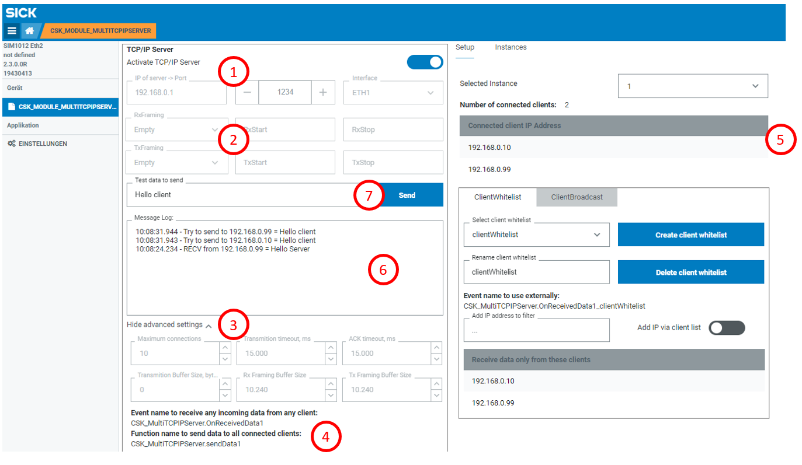
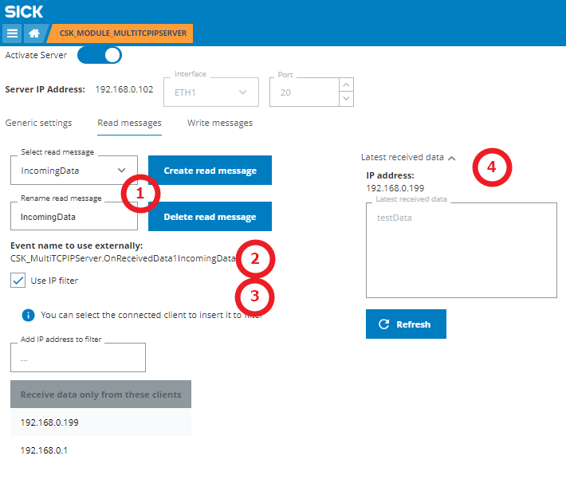
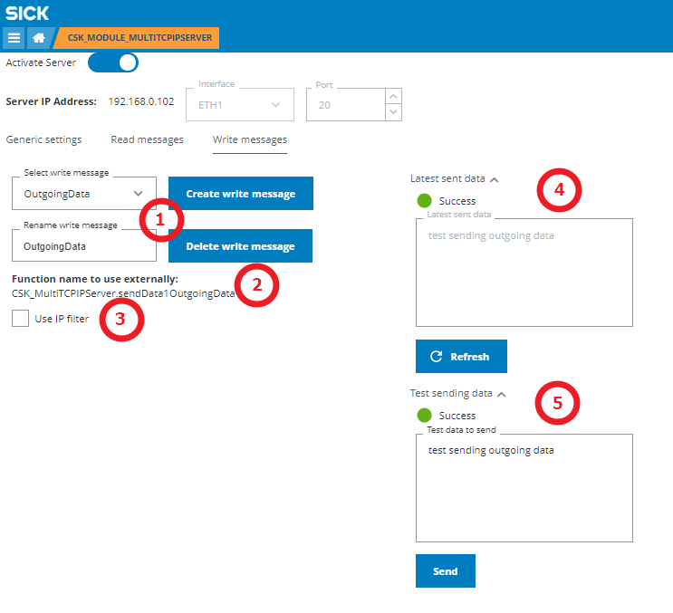

# CSK_Module_MultiTCPIPServer
This CSK module provides an easy access to TCP/IP Server functionality.

For further information check out the [documentation](https://raw.githack.com/SICKAppSpaceCodingStarterKit/CSK_Module_MultiTCPIPServer/main/docu/CSK_Module_MultiTCPIPServer.html) in the folder "docu".

## How to Run

The app includes an intuitive GUI to setup communication with IOLink device.

### Generic settings

1. Select ethernet interface and port that the server will listen to. Server must be restarted to apply the new settings
2. Set framings for received and transmitted data. Server must be restarted to apply the new settings
3. Set advanced settings of the server. Server must be restarted to apply the new settings
4. Event and function for data forwarding from/to all connected clients are shown here
5. Table with connected clients
6. Check the latest received payload and IP address it was received from
7. Check the latest data and success of sending to all clients
8. Input field to test sending data to all clients

### Read messages
Read message is the data that is expected from clients. It is possible to set an IP filter to receive this data only from specific clients.
1. Create, delete, rename and select the read message
2. Event to register for data forwarding from the selected read message is shown here
3. Enable or disable the IP address filter and add IP addresses to it here
4. Check the latest received payload of the selected read message and IP address it was received from

### Write messages
Write message is the data that will be sent to clients. It is possible to set an IP filter to send this data only to specific clients.
1. Create, delete, rename and select the write message
2. Function to call for data forwarding as the selected write message is shown here
3. Enable or disable the IP address filter and add IP addresses to it here
4. Check the latest sent payload of the selected write message and its success
5. Input field to test sending data as the selected write message

## Known issues
-

## Information

### Tested on

|Device|Firmware version|Module version|
|--|--|--|
|SIM1012|V2.3.0|v1.0.0|
|SIM1012|V2.4.1|v1.0.0|
|SICK AppEngine|V1.5.0|v1.0.0|

This application / module is part of the SICK AppSpace Coding Starter Kit developing approach.  
It is programmed in an object-oriented way. Some of the modules use kind of "classes" in Lua to make it possible to reuse code / classes in other projects.  
In general, it is not neccessary to code this way, but the architecture of this app can serve as a sample to be used especially for bigger projects and to make it easier to share code.  
Please check the [documentation](https://github.com/SICKAppSpaceCodingStarterKit/.github/blob/main/docu/SICKAppSpaceCodingStarterKit_Documentation.md) of CSK for further information.  

## Topics

Coding Starter Kit, CSK, Module, SICK-AppSpace, TCP/IP, TCPIP, Server
