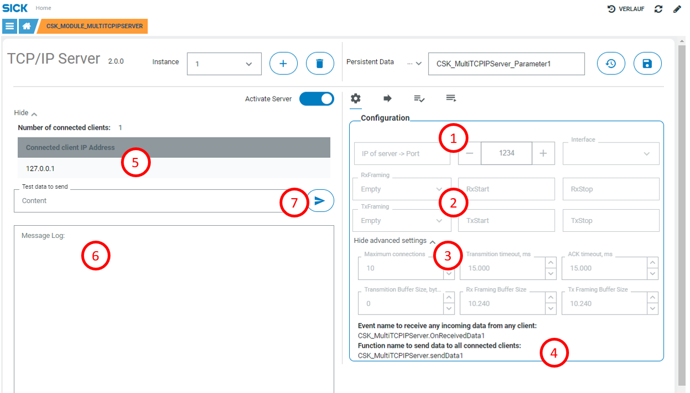
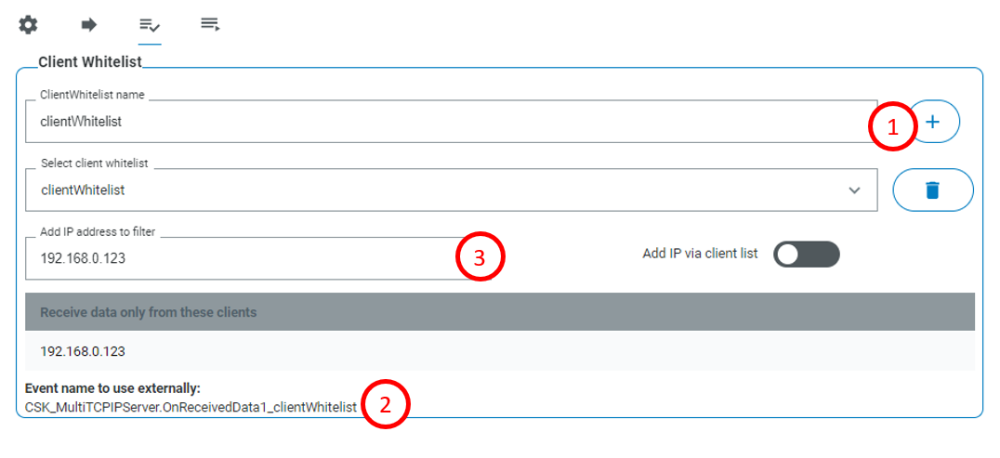
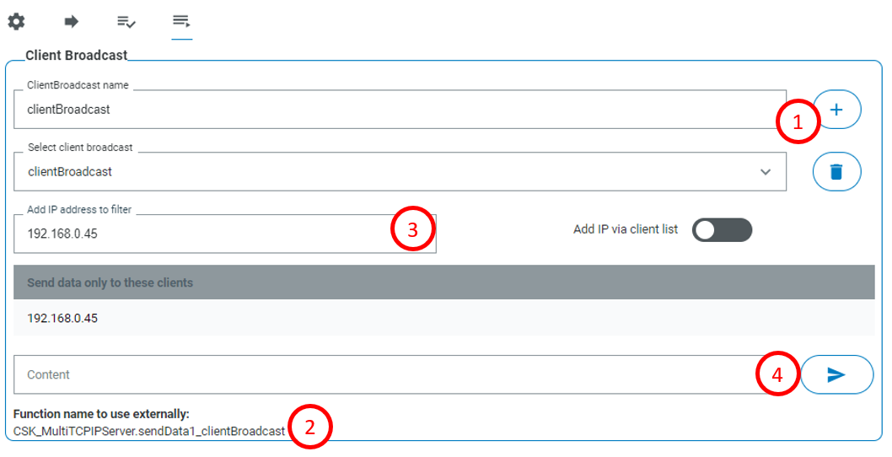

# CSK_Module_MultiTCPIPServer
This CSK module provides an easy access to TCP/IP Server functionality.

For further information check out the [documentation](https://raw.githack.com/SICKAppSpaceCodingStarterKit/CSK_Module_MultiTCPIPServer/main/docu/CSK_Module_MultiTCPIPServer.html) in the folder "docu".

## How to Run

The app includes an intuitive GUI to setup communication with IOLink device.

### Generic settings

Info: Server must be restarted to apply new settings...  

1. Select ethernet interface and port that the server will listen to. Server must be restarted to apply the new settings
2. Set framings for received and transmitted data. Server must be restarted to apply the new settings
3. Set advanced settings of the server. Server must be restarted to apply the new settings
4. Event and function for data forwarding from/to all connected clients are shown here
5. Table with connected clients
6. Check the latest received/send payload and IP address it was received/send from/to
7. Input field to test sending data to all clients

### Client whitelists
Whitelists can be used to filter for data of specific data sources. It is possible to set an IP filter for each created whitelist.  
1. Create, delete, rename and select the whitelist
2. Event to register for forwarded data from the selected whitelist is shown here
3. Add IP addresses to whitelist here

### Client broadcasts
Broadcasts can be used to send data only to specific clients. It is possible to set individual IP filter for each created broadcast.  
1. Create, delete, rename and select the broadcasts
2. Function to call to send data for the selected broadcast is shown here
3. Add IP addresses to the broadcast here
4. Input field to test sending data via the selected broadcast

## Information

### Tested on

|Device|Firmware version|Module version|
|--|--|--|
|SIM1012|V2.3.0|v1.0.0|
|SIM1012|V2.4.1|v1.0.0|
|SICK AppEngine|V1.5.0|v1.0.0|

This module is part of the SICK AppSpace Coding Starter Kit developing approach.  
It is programmed in an object-oriented way. Some of the modules use kind of "classes" in Lua to make it possible to reuse code / classes in other projects.  
In general, it is not neccessary to code this way, but the architecture of this app can serve as a sample to be used especially for bigger projects and to make it easier to share code.  
Please check the [documentation](https://github.com/SICKAppSpaceCodingStarterKit/.github/blob/main/docu/SICKAppSpaceCodingStarterKit_Documentation.md) of CSK for further information.  

## Topics

Coding Starter Kit, CSK, Module, SICK-AppSpace, TCP/IP, TCPIP, Server
